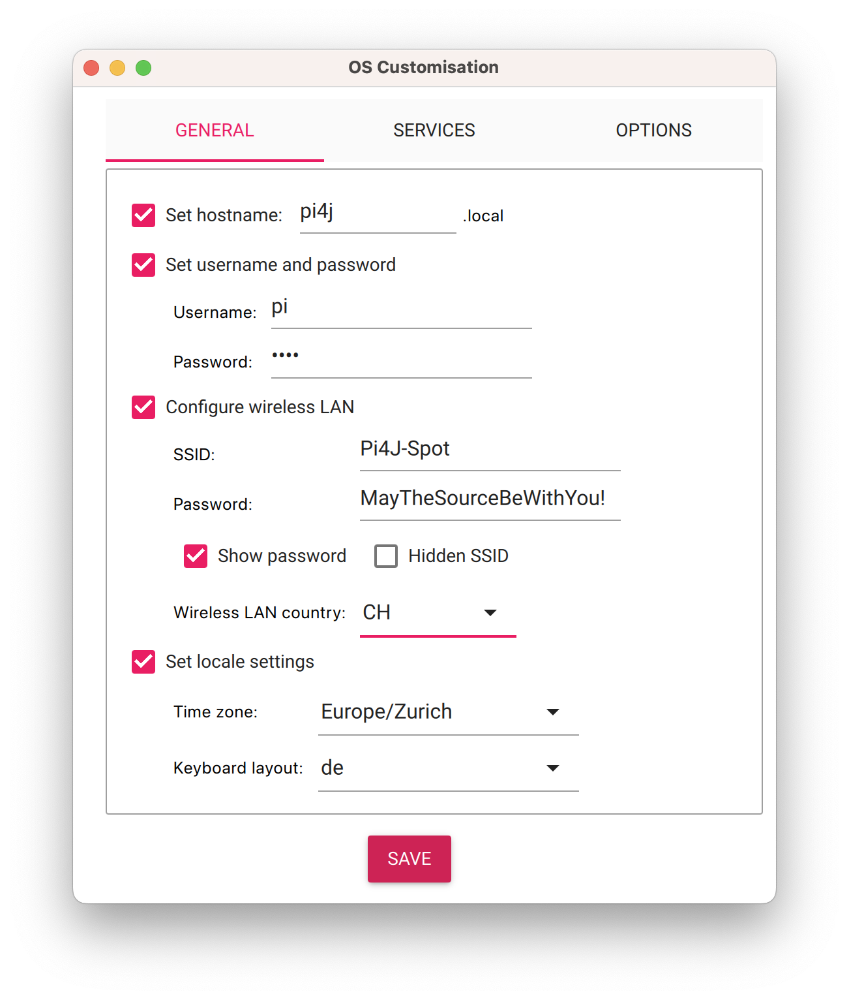
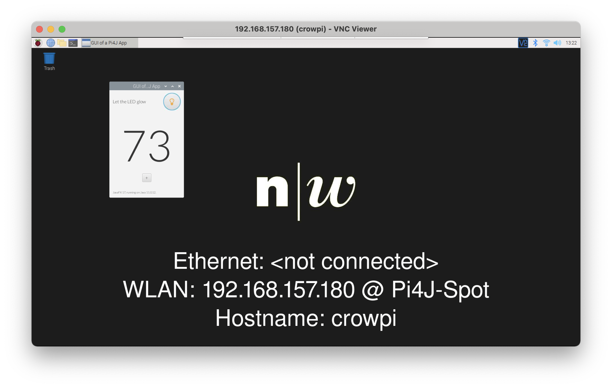
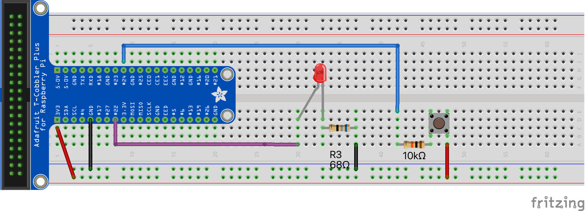
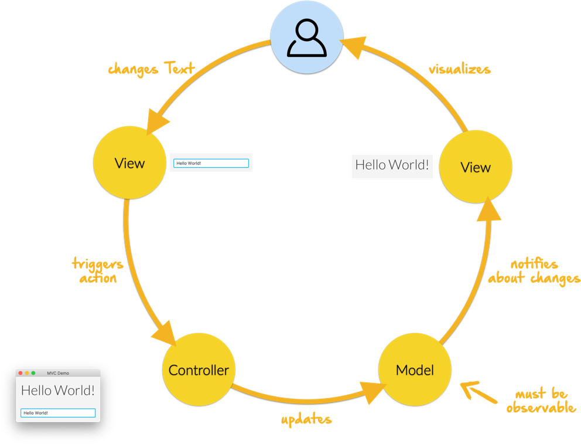

image:assets/FHNW.png[FHNW]

== Minimale Pi4J Applikation auf dem Raspberry Pi 5

Dieses Template Projekt wird für die Programmierausbildung im Rahmen der IP12-Projekte an der https://www.fhnw.ch/en/degree-programmes/engineering/icompetence[Fachhochschule Nordwestschweiz] (FHNW) eingesetzt.

== Eigenes Repository anlegen

Sie sollten für Ihr Programmier-Projekt auf keinen Fall direkt auf diesem Repository arbeiten. Stattdessen sollten Sie ein eigenes Repository unter Ihrem FHNW GitLab-Account anlegen und dieses Template-Repository als "Quelle" importieren.

==== FHNW GitLab

Auf Ihrem GitLab-Account via

`New Project -> Import Project -> Repo by URL`

das Formular ausfüllen, mit `Git repository URL` :

`https://gitlab.fhnw.ch/ip_12_preparation/hellopi5.git`

== Raspberry Pi vorbereiten

Mit https://www.raspberrypi.com/software/[Raspberry Pi Imager] den Benutzer `pi` mit Passwort `pi4j` definieren und den Setup folgendermassen vervollständigen, eine SD-Card bespielen.

Den Raspberry Pi mit der gerade bespielten SD-Card starten.

Im Terminal-Window auf dem Raspberry Pi diesen Befehl eingeben.

[source,shell]
----
curl -s "https://gitlab.fhnw.ch/ip_12_preparation/hellopi5/-/raw/main/src/assembly/setup.sh?ref_type=heads" | bash
----

Damit sind auf dem Raspberry Pi die notwendigen Konfigurationen für die IP12-Projekte vorgenommen und die Applikationen installiert. Insbesondere ist Java Version 21 installiert.

== Installationen auf dem Entwickler-Laptop

* https://adoptium.net/?variant=openjdk21&jvmVariant=hotspot[Java 21]. Im Pi4J-Basic-OS Image ist JDK21 installiert. Daher verwenden wir diesen JDK auch auf dem Laptop. Hinweis für Mac-Benutzer: Die Verwendung von SDKMAN (s.u.) für die Installation und die Verwaltung von JDKs ist sehr empfehlenswert.

* https://www.jetbrains.com/idea/download/[IntelliJ IDEA]. Es ist wichtig, die neueste Version zu verwenden. Am besten via https://www.jetbrains.com/toolbox-app/[JetBrains Toolbox] installieren. Empfehlenswert ist die Verwendung der Ultimate Edition. Studierende erhalten, nach Anmeldung, eine kostenlose Lizenz. Registrieren Sie sich unter https://www.jetbrains.com/student/ mit Ihrer FHNW E-Mail-Adresse. Für die Community-Edition benötigt man keine Lizenz.

* https://git-scm.com/downloads[Git]. Als Sourcecode-Repository verwenden wir git. 

* https://gitlab.fhnw.ch/[GitLab] oder https://github.com/[GitHub-Account]. Verwenden Sie ihren FHNW Gitlab oder GitHub Account. 

* `ssh`. Die Verbindung zum Raspberry Pi wird mit `ssh` hergestellt. Ist normalerweise auf allen Laptops vorinstalliert.

* https://www.realvnc.com/en/connect/download/viewer/[VNC Viewer]. Ermöglicht ein komfortables Arbeiten auf dem Raspberry Pi vom Laptop aus. Dadurch spart man sich das Anschliessen von Monitor, Tastatur und Maus direkt am Raspberry Pi.

== Empfehlung zur Installation des JDK für MacOS (und Linux)

Für MacOs und Linux gibt es ein sehr empfehlenswertes Tool zur Verwaltung unterschiedlicher Software Development Kits: https://sdkman.io[SDKMAN]

Insbesondere wenn, wie üblich, mehrere Java JDKs verwendet werden, hilft SDKMAN.

==== Installation von SDKMAN

Folgenden Befehl in einem Terminal eingeben:
 `shell
 export SDKMAN_DIR="$HOME/sdkman" && curl -s "https://get.sdkman.io" | bash
`

Falls Sie SDKMAN bereits früher installiert haben, müssen Sie SDKMAN auf den neuesten Stand bringen:

[source,shell]
----
sdk update
----

==== Installation des JDK

In einem neuen Terminal-Window diesen Befehl eingeben:

[source,shell]
----
sdk install java 17.0.9-tem
----

Danach liegt der JDK in ihrer Home-Directory im Folder `sdkman/candidates/java`. Von dort können Sie es dann in IntelliJ als neues SDK anlegen und im Projekt verwenden.

Mit: 

[source,shell]
----
curl -s "https://raw.githubusercontent.com/eitch/pi4j-test/develop/src/assembly/setup.sh" | bash
----

können Sie sich auflisten lassen, welche anderen JDKs zur Installation zur Verfügung stehen.

== Java Version überprüfen

In einem Terminal-Window eingeben

[source,shell]
----
java -version
----

Das sollte diese Ausgabe erzeugen

[source,shell]
----
openjdk version "17.0.9" 2023-10-17
OpenJDK Runtime Environment Temurin-17.0.9+9 (build 17.0.9+9)
OpenJDK 64-Bit Server VM Temurin-17.0.9+9 (build 17.0.9+9, mixed mode)
----

Falls das nicht der Fall ist, muss der Default-JDK umgestellt werden. Mit SDKMAN geht das einfach:

[source,shell]
----
sdk default java 17.0.9-tem
----

== Verbindung zum Raspberry Pi herstellen

Der Laptop und der Raspberry Pi müssen das gleiche WLAN verwenden.

Eine einfache Variante, dies sicherzustellen, ist das Aufsetzen eines Hotspots auf einem Smartphone, idealerweise mit diesen Parametern:

* ssid: `Pi4J-Spot`
* password: `MayTheSourceBeWithYou!`

Auf diesen Hotspot connected sich der RaspPi mit dem Pi4J-Basic-OS Image automatisch und zeigt die IP-Nummer im Hintergrundbild an.

Den Laptop ebenfalls mit dem Pi4J-Spot verbinden.

==== Verbindung via SSH

In einem Terminal-Window des Laptops:

[source,shell]
----
ssh pi@<ip.number>
Passwort: 'pi4j'
----

z.B.

[source,shell]
----
ssh pi@192.168.183.86
Passwort: 'pi4j'
----

Falls der Raspberry Pi der einzige mit dem Hotspot verbundene ist, kann `pi4j.local` anstatt der IP-Nummer verwendet werden.

[source,shell]
----
ssh pi@pi4j.local
Passwort: 'pi4j'
----

==== Verbindung via VNC

Mit derselben IP-Nummer (oder `pi4j.local`) kann auch via VNC auf den RaspPi zugegriffen werden. Man erhält auf dem Laptop ein Fenster, das den kompletten Desktop des Raspberry Pis anzeigt. 

Das Ganze sieht dann so aus (mit der gestarteten ExampleApp)

== Build System

Dieses Projekt verwendet Maven, um die Applikationen zu bauen und entweder lokal auf dem Laptop oder auf dem Raspberry Pi auszuführen.

Die Artefakte werden dabei auf dem Laptop gebaut, anschliessend auf den Raspberry Pi kopiert und dort gestartet. Die Entwicklung direkt auf dem Raspberry Pi ist zwar ebenfalls möglich, wird aber nicht empfohlen. Besser ist es, die Applikation auf dem Laptop zu entwickeln und sie auf dem Raspberry Pi lediglich ausführen zu lassen.

Dazu müssen nur wenige Konfigurationen verändert werden.

==== Einstellungen im `pom.xml`

* `launcher.class`: gibt an, welche Applikation gestartet werden soll. Im `pom.xml` ist bereits eine Liste von Kandidaten enthalten. Man muss nur bei der jeweils gewünschte Applikation die Kommentare entfernen.
* `pi.hostname`: Der Hostname des Raspberry Pis, z.B. `pi4j`, wird auf dem Monitor des Pis eingeblendet.
* `pi.ipnumber`: Die aktuelle IP-Nummer des Raspberry Pi, z.B. `192.168.1.2`, wird für SCP/SSH benötigt und wird ebenfalls auf dem Monitor angezeigt

Mit diesen Einstellungen kann die Applikation mittels Maven-Befehl auf dem Raspberry Pi gestartet werden. Besser ist es jedoch, die Run-Konfigurationen von IntelliJ zu verwenden.

==== Einstellungen in den Run-Konfigurationen

Im Projekt sind insgesamt vier Run-Konfigurationen vordefiniert, zwei zum Starten der Applikation, zwei zum Debuggen der Applikation auf dem RaspPi.
- `Run Local` startet das Programm, das in `launcher.class` eingestellt wurde, auf dem Laptop. Wird vor allem während der GUI-Entwicklung gebraucht (also noch ohne die Verwendung von an den Raspberry Pi angeschlossenen Sensoren und Aktuatoren).
- `Run on Pi` startet das Programm auf dem Raspberry Pi.
- `Debug on Pi` startet das Programm auf dem Raspberry Pi im Debug-Modus.
- `Attach to Pi Debugger` verbindet die IDE des Laptops mit dem via `Debug on Pi` gestarteten Programm. 

== Die enthaltenen Beispiel-Programme

==== HelloFX

Dient ausschliesslich der Überprüfung der JavaFX-Basis-Installation. Auf keinen Fall als Vorlage für die eigenen JavaFX-Applikationen verwenden.

Zum Starten:
- `launcher.class` im `pom.xml` auswählen
 - `<launcher.class>com.pi4j.mvc/com.pi4j.setup.HelloFX</launcher.class>`
- mit `Run local` auf dem Laptop starten
- mit `Run on Pi` auf dem RaspPi starten

Sobald der JavaFX-Setup überprüft ist, kann HelloFX gelöscht werden.

==== Wiring

Die anderen Beispielprogramme verwenden eine LED und einen Button. Diese müssen folgendermassen verdrahtet werden:

==== MinimalPi4J

Ist eine reine Pi4J-Applikation ohne GUI. Auch sie dient ausschliesslich der Überprüfung des Setups.

Zum Starten:
- `launcher.class` im `pom.xml` auswählen
 - `<launcher.class>com.pi4j.mvc/com.pi4j.setup.MinimalPi4J</launcher.class>`
- `Run local` macht für dieses Beispiel keinen Sinn. An den Laptop sind weder Button noch LED angeschlossen.
- mit `Run on Pi` auf dem RaspPi starten

Wenn der Button gedrückt wird, wird eine entsprechende Meldung in der Konsole ausgegeben.

Sobald der Pi4J-Setup überprüft ist, kann MinimalPi4J ebenfalls gelöscht werden.

==== TemplateApp

TemplateApp zeigt das Zusammenspiel eines JavaFX-basiertes Graphical-User-Interfaces (GUI) mit an den RaspPi angeschlossenen Sensoren und Aktuatoren, dem Physical-User-Interface (PUI).

Es dient als Vorlage für Ihre eigene Applikation. Das umfasst auch die enthaltenen TestCases.

Sie sollten zunächst das Beispiel kennenlernen und verstehen. Für Ihre eigene Applikation sollten Sie anschliessend die TemplateApp kopieren und entsprechend abändern, ohne dabei die Grundregeln des MVC-Konzepts zu verletzen (s.u.). 

Zum Starten:
- `launcher.class` im `pom.xml` auswählen
 - `<launcher.class>com.pi4j.mvc/com.pi4j.mvc.templateapp.AppStarter</launcher.class>`
- mit `Run local` (oder direkt aus der IDE heraus) auf dem Laptop starten. Sinnvoll für die GUI-Entwicklung. Das PUI steht auf dem Laptop nicht zur Verfügung. Das GUI kann jedoch weitgehend ohne Einsatz des RaspPis entwickelt werden
 - in `AppStarter` kann zusätzlich noch ein rudimentärer PuiEmulator gestartet werden, so dass das Zusammenspiel zwischen GUI und PUI auch auf dem Laptop überprüft werden kann.
- mit `Run on Pi` auf dem RaspPi starten (jetzt natürlich inklusive "echtem" PUI)

==== TemplatePUIApp

Das MVC-Konzept sollte auch für Applikationen ohne GUI verwendet werden.

Falls Sie eine reine PUI-Applikation entwickeln oder erst später ein GUI hinzufügen wollen, sollten Sie die `TemplatePUIApp` als Vorlage nehmen.

Zum Starten:
- `launcher.class` im `pom.xml` auswählen
 - `<launcher.class>com.pi4j.mvc/com.pi4j.mvc.templatepuiapp.AppStarter</launcher.class>`
- `Run local` ist bei reinen PUI-Applikationen nicht sinnvoll
- mit `Run on Pi` auf dem RaspPi starten

== Applikation im Debugger starten

Zum Starten einer Applikation auf dem RaspPi im Debug-Mode werden die beiden Run-Konfigurationen `Debug on Pi` und `Attach to Pi Debugger` benötigt.

Wichtig dabei ist die Reihenfolge, mit der die
Konfigurationen gestartet werden:

. Start von `Debug on Pi` via des *Run*-Knopfs
. Warten bis die Konsolenausgabe meldet `Listening for transport dt_socket at address: 5005 (Attach debugger)`
. Starten von `Attach to Pi Debugger` mit dem Debug-Knopf
. Erst danach erscheint das GUI auf dem RaspPi-Bildschirm

Nun können Sie wie gewohnt den Debugger von IntelliJ IDEA verwenden und beispielsweise Breakpoints setzen oder das Programm schrittweise ausführen.

== Das MVC-Konzept

Beim klassischen Model-View-Controller-Konzept sind neben der Starter-Klasse mindestens 3 Klassen beteiligt. Das Zusammenspiel dieser Klassen ist klar geregelt:

image:assets/mvc-concept.png[MVC Concept]

* _Model Klassen_
* enthalten den gesamten zu visualisierenden Zustand. Wir nennen diese Klassen daher _Presentation-Model_
* sind komplett unabhängig von Controller und View
* _Controller Klassen_

* stellen die gesamte Funktionalität, die sogenannten Actions, in Form von Methoden zur Verfügung
* verwalten die Model-Klassen gemäss der zugrundeliegenden Business-Logik
* haben keinen Zugriff auf die View-Klassen
* _View Klassen_

* rufen ausschliesslich Methoden auf dem Controller auf, sie "triggern Actions"
* werden vom Model über Zustandsänderungen notifiziert
** observieren den Status des Models
* ändern das Model nie direkt
* _Starter Klasse._ Ist eine Subklasse von `javafx.application.Application`. Instanziiert die drei anderen Klassen und startet die Applikation. 

In unserem Fall gibt es mindestens zwei View-Klassen

* _GUI Klasse._ Das Graphical-User-Interface. JavaFX-basierte Implementierung des auf dem Bildschirm angezeigten UIs.
* _PUI Klasse._ Das Physical-User-Interface. Pi4J-basierte Implementierung der Sensoren und Aktuatoren. Verwendet Component-Klassen, wie Sie sie aus dem sogenannten https://github.com/Pi4J/pi4j-example-components.git[Pi4J Component Catalogue] kennen.

GUI und PUI sind komplett voneinander getrennt, z.B. hat der GUI-Button zum Anschalten der LED keinen direkten Zugriff auf die LED-Component des PUIs. Stattdessen triggert der GUI-Button lediglich eine entsprechende Action im Controller, der wiederum die on-Property im Model auf den neuen Wert setzt. In einem separaten Schritt reagiert die LED-Component des PUIs auf diese Wertänderung und schaltet die LED an bzw. aus.

GUI und PUI arbeiten mit dem identischen Controller und damit auch mit dem identischen Model. 

Es ist wichtig, dass Sie dieses Konzept verstehen und für Ihr Projekt anwenden können. Gehen Sie bei Fragen auf die Fachcoaches oder OOP-Dozierenden zu.

Jede Benutzer-Interaktion durchläuft im MVC-Konzept den immer gleichen Kreislauf:

==== Projector Pattern

Unsere View-Klassen, also GUI und PUI, setzen das von Prof. Dierk König veröffentlichte https://dierk.github.io/Home/projectorPattern/ProjectorPattern.html[Projector Pattern] um. 

Die grundlegenden Aufgaben von GUI und PUI sind gleich. Auf Code-Ebene ist dies erkennbar:
sie implementieren das gemeinsames Interface `Projector`, können also auf die gleiche Weise verwendet werden.

Weitere Konsequenzen
- Es können weitere UIs hinzugefügt werden, ohne dass es Code-Änderungen bei den bestehenden Klassen (ausser der Starter-Klasse) nach sich zieht.
 - Ein Beispiel dafür ist der `PuiEmulator`, der bei Bedarf zusätzlich gestartet werden kann.
- Diese Architektur ist auch geeignet für
 - reine GUI-Applikationen und
 - reine PUI-Applikationen (siehe `TemplatePUIApp`).

=== Implementierung des MVC-Konzepts

Die Basis-Klassen, die für die Implementierung des MVC-Konzepts notwendig sind, sind im Package `com.pi4j.mvc.util.mvcbase`. Die Klassen sind im Code ausführlich dokumentiert. 

== MultiControllerApp

Ein etwas fortgeschritteneres Beispiel ist die `MultiControllerApp`. Sie zeigt den Einsatz und die Notwendigkeit von mehreren Controllern in einer Applikation.

Für einen einzelnen Controller gilt:
- jede Action wird asynchron und reihenfolgetreu ausgeführt
- dafür hat jeder Controller eine eigene `ConcurrentTaskQueue` integriert
- das UI wird dadurch während der Ausführung einer Action nicht blockiert
- werden vom UI weitere Actions getriggert während eine Action gerade in Bearbeitung ist, werden diese in der `ConcurrentTaskQueue` aufgesammelt und ausgeführt, sobald die vorherigen Actions abgearbeitet sind.

Für einfache Applikationen reicht ein einzelner Controller meist aus.

Es gibt aber Situationen, bei denen Actions ausgeführt werden sollen, während eine andere Action noch läuft.

Die `MultiControllerApp` zeigt so ein Beispiel. Es soll möglich sein, den Counter zu verändern _während die LED blinkt_ .
- Mit einem einzigen Controller ist das nicht umsetzbar. Der Controller würde beispielsweise die 'Decrease-Action' erst ausführen, nachdem die 'Blink-Action' abgeschlossen ist.
- Bei zwei Controllern ist es jedoch einfach: `LedController` und `CounterController` haben jeder eine `ConcurrentTaskQueue`. Actions, die die LED betreffen, werden also unabhängig von den Actions, die den Counter verändern, ausgeführt.
- Es sollte zusätzlich ein `ApplicationController` implementiert werden, der die anderen Controller koordiniert und das für das UI sichtbare API zur Verfügung stellt.

Zum Starten:
- `launcher.class` im `pom.xml` auswählen
 - `<launcher.class>com.pi4j.mvc/com.pi4j.mvc.multicontrollerapp.AppStarter</launcher.class>`
- mit `Run local` (oder direkt aus der IDE heraus) auf dem Laptop starten. +
 - in `AppStarter` kann zusätzlich noch ein rudimentärer PuiEmulator gestartet werden, so dass das Zusammenspiel zwischen GUI und PUI auch auf dem Laptop überprüft werden kann.
- mit `Run on Pi` auf dem RaspPi starten

== JUnit Tests

Durch die klare Trennung in Model, View und Controller können grosse Teile der Applikation mittels einfachen JUnit-Tests automatisiert getestet werden. Diese Tests werden in der Regel auf dem Laptop, also nicht auf dem RaspPi, ausgeführt.

==== Controller Tests

Der Controller implementiert die gesamte zur Verfügung stehende Grund-Funktionalität. Er sollte mit ausführlichen TestCases automatisch überprüft werden.

Dabei gilt es zu beachten, dass der Controller alle Veränderungen auf dem Model asynchron ausführt. Eine Überprüfung der Resultate ist also erst möglich, wenn die asynchrone Task beendet ist.

Ein Beispiel sehen Sie in `SomeControllerTest`.

==== Presentation-Model Tests

Das Model ist lediglich eine Ansammlung von `ObservableValues` und bietet darüber hinaus keine weitere Funktionalität. Daher sind normalerweise auch keine weiteren TestCases notwendig.

==== Tests für einzelne PUI-Components

Die einzelnen PUI-Components können sehr gut via der in Pi4J integrierten `MockPlatform` getestet werden. Diese Tests werden auf dem Laptop ausgeführt. Ein RaspPi ist nicht notwendig.

Beispiele für solche Component-Tests sehen Sie im https://fhnw-ip5-ip6.github.io/CrowPiGoesJavaTutorial/de/[CrowPi-Tutorial] und in diesem Projekt im Package `com.pi4j.mvc.templateapp.view.pui.components`.

==== PUI Tests

Das PUI ihrer Applikation kann ebenfalls gut mittels JUnit getestet werden.

Auch hier müssen die Tests berücksichtigen, dass die Actions asynchron ausgeführt werden.

Ein Beispiel ist `SomePUITest`.

== LICENSE

This repository is licensed under the Apache License, Version 2.0 (the "License"); you may not use this file except in compliance with the
License. You may obtain a copy of the License at: http://www.apache.org/licenses/LICENSE-2.0

Unless required by applicable law or agreed to in writing, software distributed under the License is distributed on an "AS IS" BASIS,
WITHOUT WARRANTIES OR CONDITIONS OF ANY KIND, either express or implied. See the License for the specific language governing permissions and
limitations under the License.