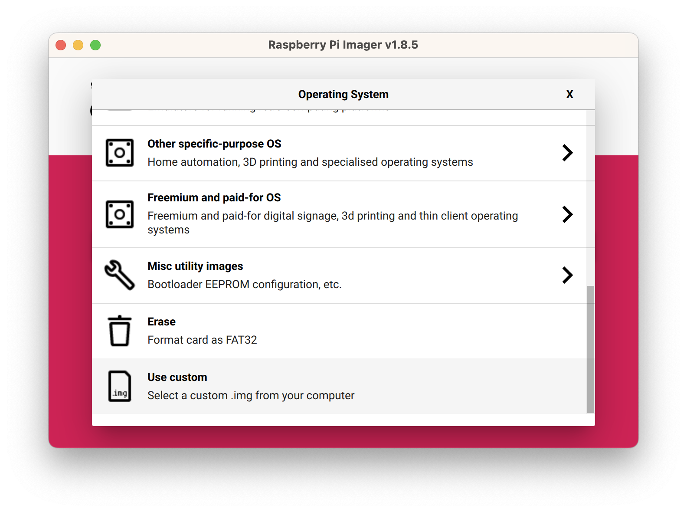
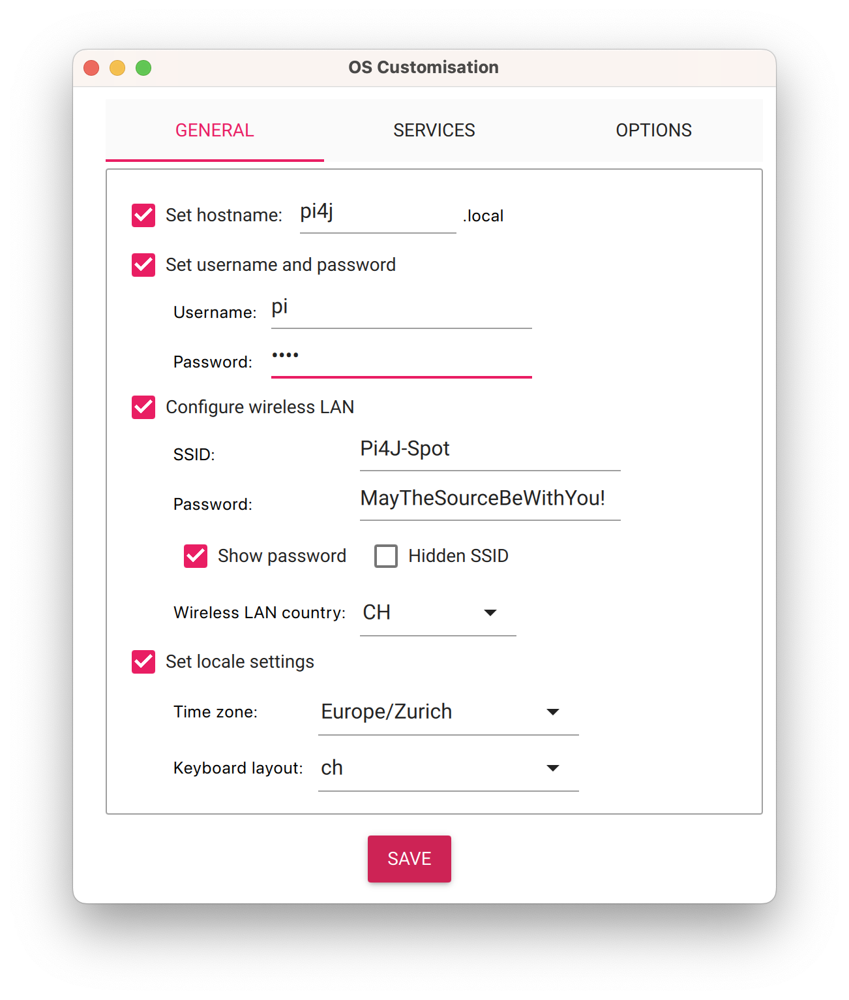
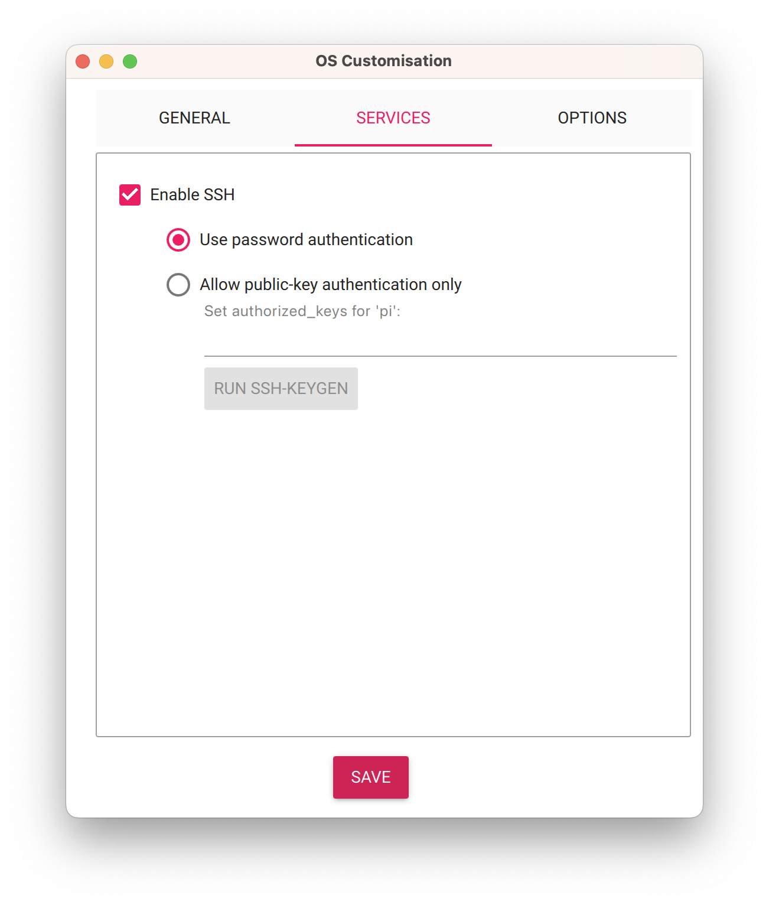

image:assets/FHNW.png[FHNW]

== Minimale Pi4J Applikation auf dem Raspberry Pi 5

Dieses Projekt wird für die Programmierausbildung im Rahmen der IP12-Projekte an der https://www.fhnw.ch/en/degree-programmes/engineering/icompetence[Fachhochschule Nordwestschweiz] (FHNW) eingesetzt.

Es dient in erster Linie dazu, den notwendigen Setup auf dem Raspberry Pi und dem Entwickler Laptop vorzunehmen und zu überprüfen.

=== Raspberry Pi vorbereiten

Um den Raspberry Pi für ein IP12-Projekt vorzubereiten haben Sie zwei Möglichkeiten:

* das vorgefertigte IP12-Image verwenden (empfohlen)
* ein Linux-Image selbst erzeugen

==== IP12-Image verwenden

[Linux-Image herunterladen] und z.B. auf dem Desktop Ihres Laptops ablegen.

Dieses Image ist für die Anforderungen eines IP12-Projekts vorkonfiguriert. Es sind keine weiteren Installationen notwendig.

- Im https://www.raspberrypi.com/software/[Raspberry Pi Imager] unter `CHOOSE OS` den untersten Eintrag `Use Custom` auswählen und den gerade heruntergeladenen Image-File auswählen.
- Den Raspberry Pi mit der gerade bespielten SD-Card starten.

==== Linux-Image selbst erstellen

Mit https://www.raspberrypi.com/software/[Raspberry Pi Imager] eine SD-Card bespielen

* Raspberry Pi Imager starten
* Raspberry Pi Device: `RASPBERRY PI 5`
* Operating System: `RASPBERRY PI OS (64-BIT)
* Storage: Die SD-Card, die mit dem Linux-Image bespielt werden soll
* EDIT SETTINGS:
** den Benutzer `pi` mit Passwort `pi4j` definieren und den Setup folgendermassen vervollständigen.

==== Wlan-Hotspot einrichten

Der Laptop und der Raspberry Pi müssen das gleiche WLAN verwenden.

Eine einfache Variante, dies sicherzustellen, ist das Aufsetzen eines Hotspots auf einem Smartphone, idealerweise mit diesen Parametern:

* ssid: `Pi4J-Spot`
* password: `MayTheSourceBeWithYou!`

Auf diesen Hotspot verbindet sich der RaspPi mit dem vorkonfigurieten Linux-Image automatisch.

==== Installation vervollständigen

Den Raspberry Pi mit der gerade bespielten SD-Card starten.

Im Terminal-Window auf dem Raspberry Pi diesen Befehl eingeben.

[source,shell]
----
curl -s "https://gitlab.fhnw.ch/ip_12_preparation/hellopi5/-/raw/main/src/assembly/setup.sh?ref_type=heads" | bash
----

TIP: Anstatt das Terminal-Window auf dem Raspberry Pi zu verwenden, können Sie sich auch via `ssh` verbinden (siehe unten).

Damit sind auf dem Raspberry Pi die notwendigen Konfigurationen für die IP12-Projekte vorgenommen und die Applikationen installiert. Insbesondere ist Java Version 21 installiert.

=== Installationen auf dem Entwickler-Laptop

* https://adoptium.net/?variant=openjdk21&jvmVariant=hotspot[Java 21]. In den IP12-Linux-Images ist JDK21 installiert. Daher verwenden wir diesen JDK auch auf dem Laptop.

TIP: Mac- und Linux-Benutzer sollten SDKMAN (s.u.) für die Installation und die Verwaltung von JDKs verwenden.

* https://www.jetbrains.com/idea/download/[IntelliJ IDEA]. Es ist wichtig, die neueste Version zu verwenden. Am besten via https://www.jetbrains.com/toolbox-app/[JetBrains Toolbox] installieren. Empfehlenswert ist die Verwendung der Ultimate Edition.
** Studierende erhalten, nach Anmeldung, eine kostenlose Lizenz. Registrieren Sie sich unter https://www.jetbrains.com/student/ mit Ihrer FHNW E-Mail-Adresse.
** Für die Community-Edition benötigt man keine Lizenz.

* https://git-scm.com/downloads[Git]. Als Sourcecode-Repository verwenden wir git. 

* https://gitlab.fhnw.ch/[GitLab]. Verwenden Sie ihren FHNW Gitlab Account.

* `ssh`. Die Verbindung zum Raspberry Pi wird mit `ssh` hergestellt. Ist normalerweise auf allen Laptops vorinstalliert.

* https://www.realvnc.com/en/connect/download/viewer/[VNC Viewer]. Ermöglicht ein komfortables Arbeiten auf dem Raspberry Pi vom Laptop aus. Dadurch spart man sich das Anschliessen von Monitor, Tastatur und Maus direkt am Raspberry Pi.

=== Empfehlung zur Installation des JDK für MacOS (und Linux)

Für MacOs und Linux gibt es ein sehr empfehlenswertes Tool zur Verwaltung unterschiedlicher Software Development Kits: https://sdkman.io[SDKMAN]

Insbesondere wenn, wie üblich, mehrere Java JDKs verwendet werden, hilft SDKMAN.

==== Installation von SDKMAN

Falls Sie SDKMAN noch nicht installiert haben: Folgenden Befehl in einem Terminal eingeben:

[source,shell]
----
export SDKMAN_DIR="$HOME/sdkman" && curl -s "https://get.sdkman.io" | bash
----

Falls Sie SDKMAN bereits früher installiert haben, müssen Sie SDKMAN auf den neuesten Stand bringen:

[source,shell]
----
sdk update
----

==== Installation des JDK

In einem **neuen **Terminal-Window diesen Befehl eingeben:

[source,shell]
----
sdk install java 21.0.4-tem
----

Danach liegt der JDK in ihrer Home-Directory im Folder `sdkman/candidates/java`. Von dort können Sie es dann in IntelliJ als neues SDK anlegen und im Projekt verwenden.

Mit: 

[source,shell]
----
sdk ls java
----

können Sie sich auflisten lassen, welche anderen JDKs zur Installation zur Verfügung stehen.

== Java Version überprüfen

In einem Terminal-Window eingeben

[source,shell]
----
java -version
----

Das sollte diese Ausgabe erzeugen:

[source,shell]
----
openjdk version "21.0.4" 2024-07-16 LTS
OpenJDK Runtime Environment Temurin-21.0.4+7 (build 21.0.4+7-LTS)
OpenJDK 64-Bit Server VM Temurin-21.0.4+7 (build 21.0.4+7-LTS, mixed mode)
----

Falls das nicht der Fall ist, muss der Default-JDK umgestellt werden. Mit SDKMAN geht das einfach:

[source,shell]
----
sdk default java 21.0.4-tem
----

=== Verbindung zum Raspberry Pi herstellen

==== Wlan-Hotspot einrichten

Der Laptop und der Raspberry Pi müssen das gleiche WLAN verwenden.

Eine einfache Variante, dies sicherzustellen, ist das Aufsetzen eines Hotspots auf einem Smartphone, idealerweise mit diesen Parametern:

* ssid: `Pi4J-Spot`
* password: `MayTheSourceBeWithYou!`

Auf diesen Hotspot verbindet sich der RaspPi mit dem IP12-Image automatisch.

Den Laptop ebenfalls mit dem Pi4J-Spot verbinden.

==== Verbindung via SSH

In einem Terminal-Window des Laptops:

[source,shell]
----
ssh pi@<ip.number>
Passwort: 'pi4j'
----

z.B.

[source,shell]
----
ssh pi@192.168.183.86
Passwort: 'pi4j'
----

TIP: Die IP-Nummer des Raspberry Pis erhalten Sie mit dem Kommando `hostname -I`

Falls der Raspberry Pi der einzige mit dem Hotspot verbundene ist, kann `pi4j.local` anstatt der IP-Nummer verwendet werden.

[source,shell]
----
ssh pi@pi4j.local
Passwort: 'pi4j'
----

==== Verbindung via VNC

Mit derselben IP-Nummer (oder `pi4j.local`) kann auch via VNC auf den RaspPi zugegriffen werden. Man erhält auf dem Laptop ein Fenster, das den kompletten Desktop des Raspberry Pis anzeigt. 

=== Build System

Dieses Projekt verwendet Maven, um die Applikationen auf dem Raspberry Pi auszuführen.

Die Artefakte werden dabei auf dem Laptop gebaut, anschliessend auf den Raspberry Pi kopiert und dort gestartet. Die Entwicklung direkt auf dem Raspberry Pi ist zwar ebenfalls möglich, wird aber nicht empfohlen. Besser ist es, die Applikation auf dem Laptop zu entwickeln und sie auf dem Raspberry Pi lediglich ausführen zu lassen.

Dazu müssen nur wenige Konfigurationen verändert werden.

==== Einstellungen im `pom.xml`

* `launcher.class`: gibt an, welche Applikation gestartet werden soll.
* `pi.hostname`: Der Hostname des Raspberry Pis, in der Regel `pi4j`.
* `pi.ipnumber`: Die aktuelle IP-Nummer des Raspberry Pi, z.B. `192.168.1.2`, wird auch für `SSH`und `VNC` benötigt.

Mit diesen Einstellungen kann die Applikation mittels Maven-Befehl auf dem Raspberry Pi gestartet werden. Einfacher ist es jedoch, die Run-Konfigurationen von IntelliJ zu verwenden.

==== Die Run-Konfigurationen

Im Projekt sind insgesamt vier Run-Konfigurationen vordefiniert, zwei zum Starten, zwei zum Debuggen der Applikation auf dem RaspPi.
- `Run on Pi` startet das Programm auf dem Raspberry Pi.
- `Restart on Pi` startet das zuletzt gestartete Programm nochmal.
- `Debug on Pi` startet das Programm auf dem Raspberry Pi im Debug-Modus.
- `Attach to Pi Debugger` verbindet die IDE des Laptops mit dem via `Debug on Pi` gestarteten Programm. 

=== Das enthaltene Beispiel-Programm

==== Wiring

Das Beispielprogramm verwendet eine LED und einen Button. Diese müssen folgendermassen verdrahtet werden:

image:assets/wiring_bb.png[Wiring]

==== HelloGpio

`HelloGpio` ist eine minimale Pi4J-Applikation ohne GUI. Sie dient vor allem der Überprüfung des Setups.

Zum Starten:

* `launcher.class` im `pom.xml` setzen
** `<launcher.class>ch.fhnw.hellopi.HelloGpio</launcher.class>`
* mit `Run on Pi` auf dem RaspPi starten

Nach dem Programmstart blinkt die LED dreimal.

Wenn der Button gedrückt wird, wird eine entsprechende Meldung in der Konsole ausgegeben und die LED leuchtet.

=== Applikation im Debugger starten

Zum Starten einer Applikation auf dem Raspberry Pi im Debug-Mode werden die beiden Run-Konfigurationen `Debug on Pi` und `Attach to Pi Debugger` benötigt.

Wichtig dabei ist die Reihenfolge, mit der die
Konfigurationen gestartet werden:

1. Start von `Debug on Pi` via des **Run**-Knopfs
2. Warten bis die Konsolenausgabe meldet `Listening for transport dt_socket at address: 5005 (Attach debugger)`
3. Starten von `Attach to Pi Debugger` mit dem Debug-Knopf
4. Erst dann startet das Beispiel-Programm

Nun können Sie wie gewohnt den Debugger von IntelliJ IDEA verwenden und beispielsweise Breakpoints setzen oder das Programm schrittweise ausführen.

=== LICENSE

This repository is licensed under the Apache License, Version 2.0 (the "License"); you may not use this file except in compliance with the
License. You may obtain a copy of the License at: http://www.apache.org/licenses/LICENSE-2.0

Unless required by applicable law or agreed to in writing, software distributed under the License is distributed on an "AS IS" BASIS,
WITHOUT WARRANTIES OR CONDITIONS OF ANY KIND, either express or implied. See the License for the specific language governing permissions and
limitations under the License.